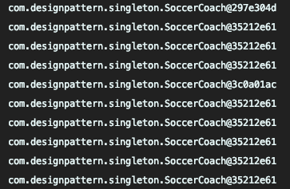

# Singleton Pattern

생성 패턴의 하나임 

객체를 하나만 생성하도록 하며 생성된 객체를 어디서든 참조할수 있도록 하는 패턴

#### 소스설명 

축구 감독은 하나이며 감독이 둘이 된다면 축구팀의 팀 방향은 갈피를 못잡을 것이다.

 멀티 스레드 환경에서도 감독은 하나여야 하며 늦은 초기화 방식으로 구현함.



```java
public class SoccerCoach {
	public static SoccerCoach SOCCER_COACH = null;

	private SoccerCoach() {
	}

	public static SoccerCoach getInstance() {
		if (SOCCER_COACH == null) {
			SOCCER_COACH = new SoccerCoach();
		}

		return SOCCER_COACH;
	}
}
```





```java
public class SoccerCoarchLazyHolder {
	private SoccerCoarchLazyHolder() {
	}

	public static SoccerCoarchLazyHolder getInstance() {
		return LazyHolder.INSTANCE;
	}

	private static class LazyHolder {
		private static final SoccerCoarchLazyHolder INSTANCE = new SoccerCoarchLazyHolder();
	}
}
```





```java
public class Main {
	public static void main(String[] args) {
		ExecutorService executorService = Executors.newFixedThreadPool(10);

		for (int i = 0; i < 10; i++) {
			executorService.submit(() -> {
				System.out.println(SoccerCoach.getInstance());
			});

		}

		executorService.shutdown();
		System.out.println("감독은 하나다" +  SoccerCoarchLazyHolder.getInstance());
	}

}
```





스레드 세이프 하지 않으면 위 그림 처럼 객체 주소가 다르게 생성된 것을 볼 수 있다


