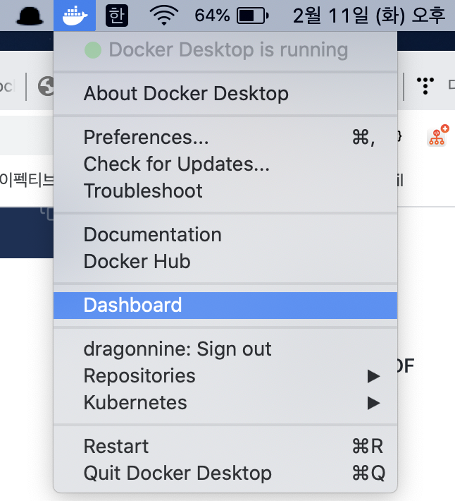
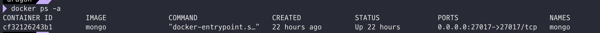

# MongoDB 로컬에서 Docker로 실행하기\(MAC에서\)

 개발 환경의 빠른 변화로 인해 담당하는 프로젝트마다 개발환경이 항상 다르고 매번  프로젝트에  맞게 개발 환경을 구축해야되는게 여간 귀찮은 일이 아니다. 그래서 이번 프로젝트에서는 도커를 사용해 몽고DB를 로컬 환경에 구축 하기로 하였다.

### 1.Docker 설치

아래 URL에서 다운로드를 하여 MAC에 설치 한다.

[https://hub.docker.com/editions/community/docker-ce-desktop-mac](https://hub.docker.com/editions/community/docker-ce-desktop-mac)

### 2.docker 명령어를 통해서 버전 확인

아래 명령어를 통해서 docker  버전을 확인하여 docker가 정상적으로 설치 되었는지 확인한다.

```bash
$ docker --version
```

### 3. dockerHub에서 MongoDB검색

1. [https://hub.docker.com](https://hub.docker.com/) 접근
2. 상단 검색창에 mongodb검색
3. 검색된 mongodb 클릭해서 상세 페이지 접근
4. docker pull mongo 카피

### 4. 터미널에 mongo 이미지 pull

터미널을 열고 docker pull mongo 명령어 실행하면 mongodb 이미지 받아옴

### 5. docker dashboard를 통해 mongodb 실행

docker메뉴에서 dashboard를 실행하면 내가 pull해온 이미지가 dashboard에 보임 \(물론 로그인 해야함\)



dashboard에서 mongodb가 보이는데 재생 버튼을 통해서 mongodb 실행

### 6. localhost:27017를 통해서 mongodb가 잘 실행되었는지 확인

브라우저에서 입력 후 아래와 같은 메세지가 보인다면 성

```text
It looks like you are trying to access MongoDB over HTTP on the native driver port.
```

ps명령어를 통해서도 확인 가능 stauts에 up이라고 되어있으면 실행 성

```bash
$ docker ps -a
```



이제 localhots:27017 접속 정보를 프로젝트에 입력하여 접속 세팅 해주기만 하면 끝남 

세팅하는 방법은 다음 정리 시간에 기록 하기로 함.

### 7. shell을 통해서 mongodb 명령어  실행 방법

mongodb gui툴인  robo3 T를 통해 명령어를 실행해 볼 수 도 있지만 다운로드 하기가 귀찮을땐 직접 쉘을 통해서 명령어를 입력 할 수 있다. 그런데 docker를 통해서 실행 했으니 방법이 조금 다르다.

docker로 몽고db 실행 후 아래 명령어를 실

```bash
$ docker exec -it mongo /bin/bash
```

그리고 usr/bin 폴더에서 mongo실행

```bash
$ cd /usr/bin/
$ mongo
```


